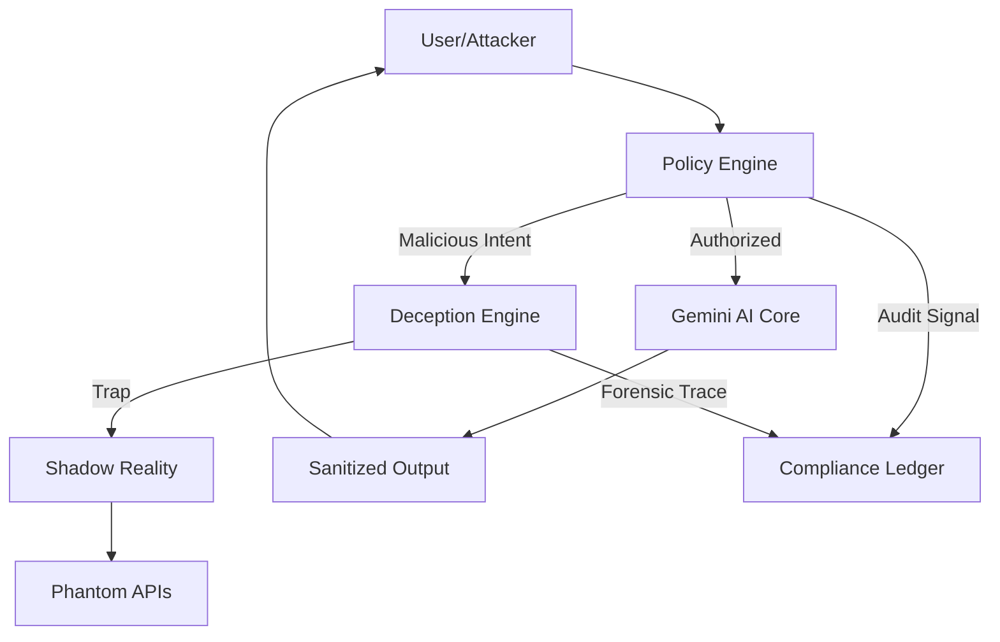

# Agentic AI Engineer Voice Mentor & Deception Engine

\

**Sentinel Protocol** is a production-grade security dashboard and adversarial simulation platform designed specifically for **Agentic AI**. It bridges the gap between autonomous AI reasoning and rigorous compliance standards like SOC 2, using a unique mix of Policy Enforcement and Deception Engineering.

---

## 🚀 Key Features

### 🧠 Sentinel Mentor (AI Chat)

A secure terminal interface powered by **Google Gemini AI**. It provides real-time security guidance while strictly enforcing data privacy policies.

- **SOC 2 Access Control**: Every prompt is validated before reaching the LLM.
- **PII Redaction**: Automatic interception of sensitive data (Passwords, SSNs).

### 🎭 Deception Engineering (The "Adversarial Maze")

Moving beyond passive defense, Sentinel uses active deception to neutralize threats:

- **Phantom Privileges**: Grants fake elevated access to suspicious actors.
- **Shadow Reality**: Redirects attackers to mirrored environments with fake data.
- **Reverse Honeyprompts**: Detects model compromise with 100% confidence markers.

### 📋 Compliance Ledger

An immutable, real-time audit trail of every system decision.

- **SOC 2 Mapping**: Every ALLOW/DENY signal is mapped to specific TSC controls (e.g., CC6.1, CC7.4).
- **Forensic Metadata**: Deep-trace IDs for historical incident reconstruction.

### 🎙️ Voice & Telemetry

- **Real-time Audio Link**: Low-latency voice interaction with the AI via WebRTC.
- **Network Telemetry**: Live system performance and security state visualization.

---

## 🛠️ Tech Stack

- **Core**: React 18, Vite, TypeScript
- **AI**: Google Gemini AI (@google/genai)
- **Animation**: Framer Motion
- **Styling**: Tailwind CSS (Premium Glassmorphism Aesthetic)
- **Icons**: Lucide React
- **Verification**: Red Team Adversarial Engine

---

## 🏗️ Technical Architecture

---

## 🛡️ Security & Compliance

This project is built to address the **OWASP LLM Top 10** and common SOC 2 audit failures.

- **CC6.1**: Identity & Access Management
- **CC7.4**: Incident Detection & Response
- **LLM-01**: Prompt Injection Mitigation

---

## 🗺️ Roadmap

- [ ] **Multi-Agent Orchestration**: Secure communication between multiple autonomous agents.
- [ ] **Blockchain Ledger**: Moving the Compliance Ledger to an on-chain immutable record.
- [ ] **Mobile Interface**: PWA support for on-the-go security monitoring.

